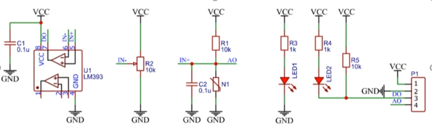

# 传感器工作原理
日期：2025-10-22

标签：`传感器` `LM393` `阈值调节` `上拉下拉`

## 现象分析

通过滑动变阻器R2设定IN-电压（可调的阈值电压）

IN+通过N1（传感器）电阻的改变从而改变AO的输出电压

LM393是电压比较器，将R2的输出IN-电压和IN+比较，
引脚输出端DO输出VCC或GND，这就是数字电压

#### 上拉下拉

R1为上拉电阻，N1可以看作下拉电阻，上拉提供VCC，下拉提供GND

N1阻值减小时，下拉作用增强，中间AO端口电压会降低，极端情况下RN1=0，AO完全下拉，输出0V

## 原因

## 修复验证

