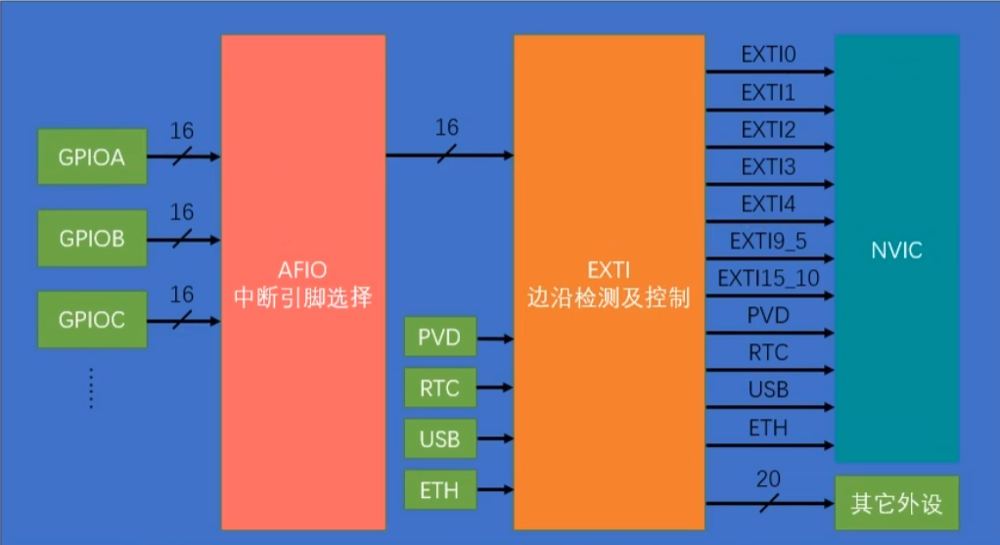

# STM32中断函数
日期：2025-10-28

标签：`中断` `STM32` `EXTI` `NVIC`

## 外部中断流程


## 寄存器配置过程

### 1、RCC总线 配置

### 2、GPIO引脚(或是其他外部中断源) 配置

### 3、EXIT外部中断/事件控制器 配置
把外部引脚（GPIO 引脚）或某些内部信号（PVD、RTC、USB 唤醒等）转换成可配置的“中断”或“事件”触发源。支持上升沿、下降沿、双沿触发(EXTI_Trigger_Rising/Falling)。

### 4、NVIC嵌套向量中断控制器 配置
保存“中断向量表”入口地址。

使能/屏蔽各个外设中断通道。

维护每个中断的优先级，并决定谁可以抢占谁（嵌套）。

## 关键代码

初始化：

RCC_APB2PeriphClockCmd -> GPIO_Init -> GPIO_EXTILineConfig(配置具体管脚，这里是GPIO) -> EXTI_Init -> NVIC_Init

使用：

注：无需在.h里声明
```c
void EXTI15_10_IRQHandler(void){ // 具体函数名去中断向量表里找
    if(EXTI_GetITStatus(EXTI_Line14) != RESET){ // 事件
        // 处理中断

        EXTI_ClearITPendingBit(EXTI_Line14);
    }
}
```