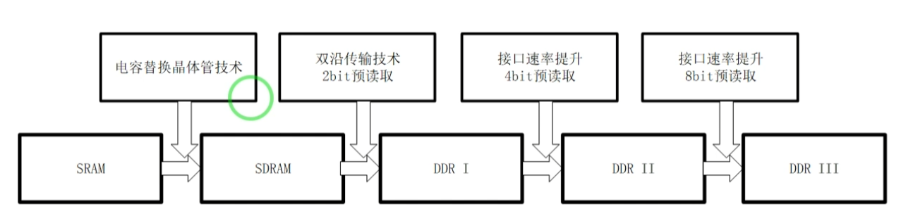
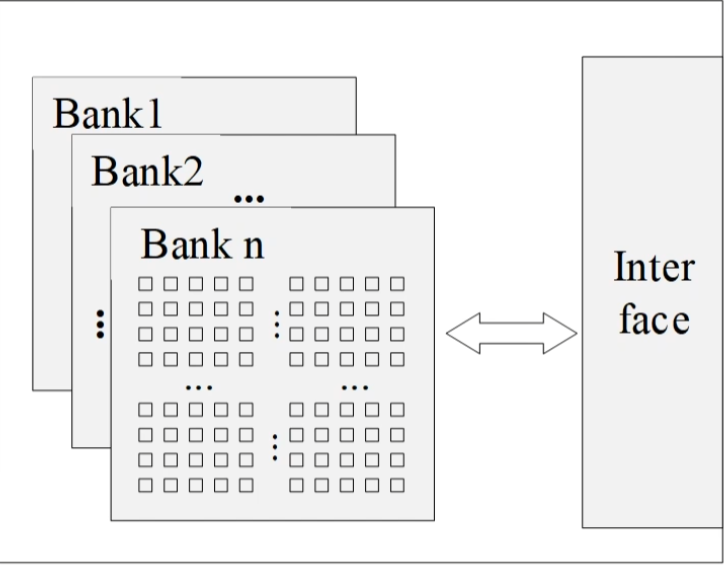
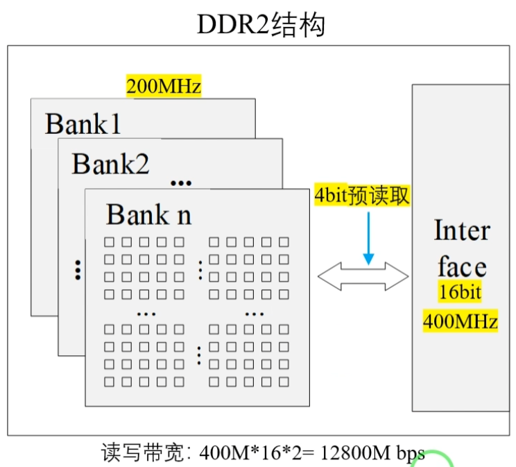
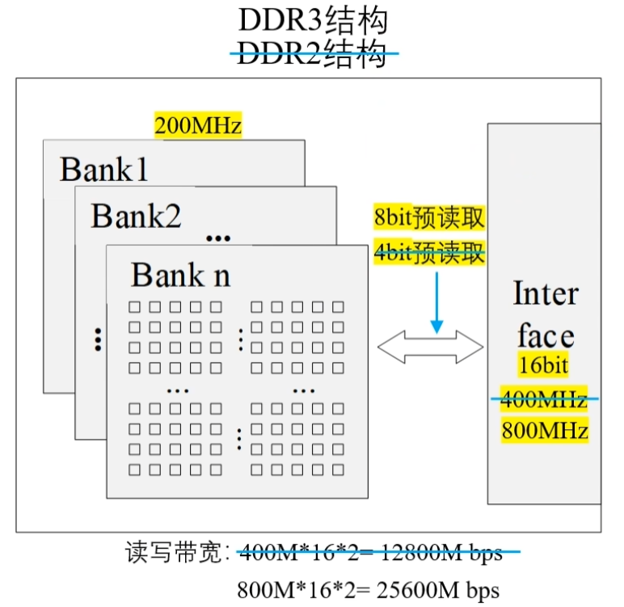

# DDR
日期：2025-11-05

标签：`DDR`

以下是DDR结构，内部由两部分组成：存储阵列和接口逻辑

前提：内部存储阵列速率不高（可能会跑飞，出现收敛问题）

#### 矩阵使用单沿传输 接口使用双沿传输 如何匹配？ ->预读取功能

eg.假设一次读取16bit，从矩阵中一次读取32bit数据，分成两个16bit，通过上升沿和下降沿发出去，每次从存储器中读取的数据都是两倍于接口的位宽（即有2bit的预读取）

对于DDR2来说，存储矩阵的时钟固定，增加预读取的bit数，就可以对应增加接口的速率，从而达到增大带宽的作用。

DDR3在DDR2基础上继续增大预读取的bit数，增大接口的频率，继续提升带宽

