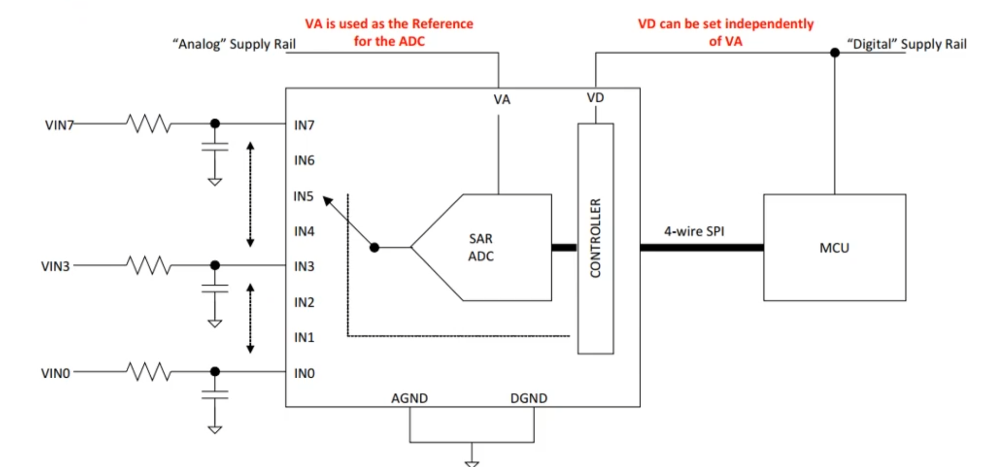
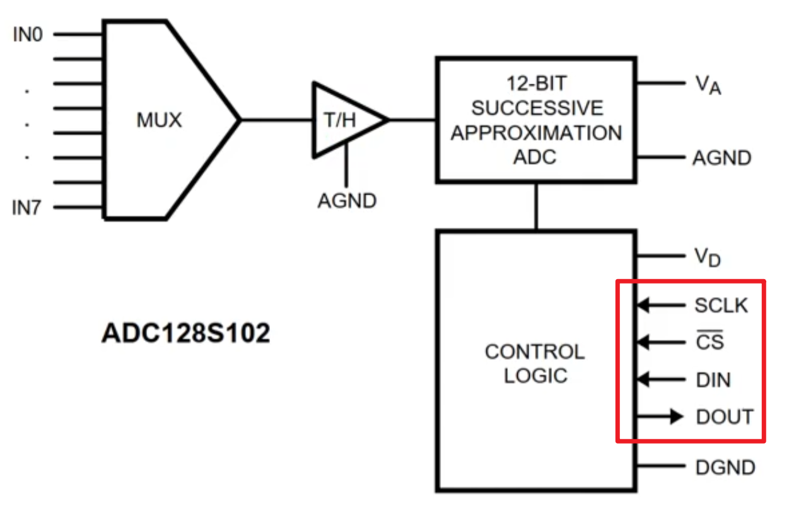
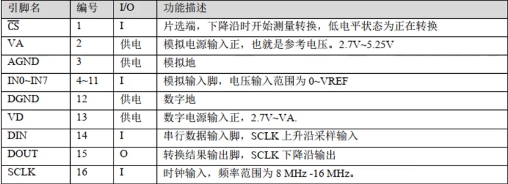
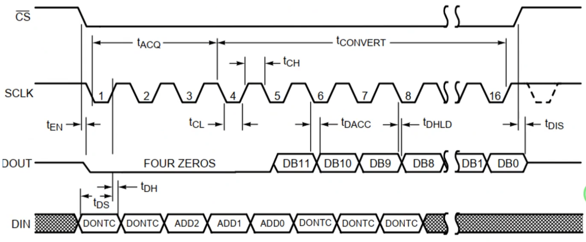
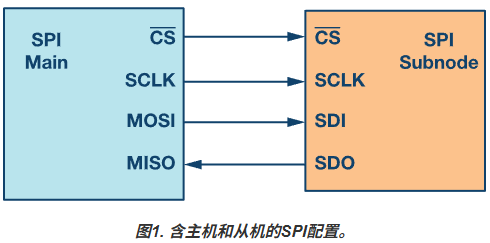

# SPI和ADCdatasheet使用指南
日期：2025-11-05

标签：`SPI` `ADC` `数据手册` `接口时序`

## 以ADC128S102为例

以下是ADC128S102的功能框图以及引脚功能

其中4-wire SPI就是红框中的SPI标准引脚，包括SCLK、CS、DIN、DOUT，其中：

SCLK：时钟信号

CS：IN0到IN7的片选信号

DIN：输入配置端口

DOUT：输出配置端口

接下来是引脚功能描述以及引脚时序图

注意事项：分清楚上升沿和下降沿哪里传输数据和采样

## SPI

其中：

MOSI：master output slave input

MISO: master input slave output

